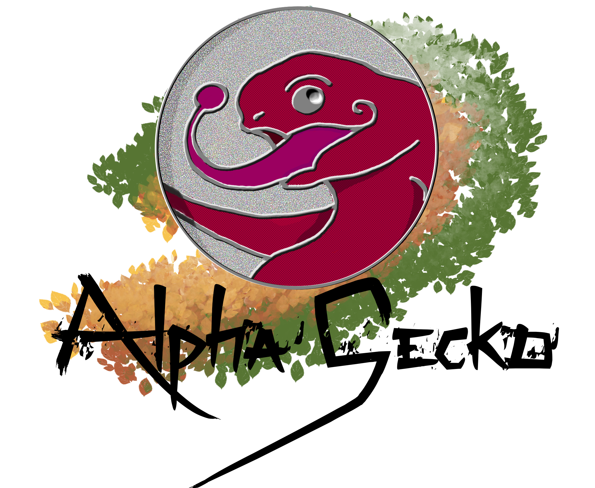

# madamePee

********************************************************************************************************************************
Ici sont stockés et mis à jour les fichiers relatifs à la personnalisation du style du site de MadamePee
********************************************************************************************************************************

Le code CSS est à mettre dans : Divi / Options du thème / L'intégration, dans  "Ajouter ligne de code à la < head > de votre blog"

